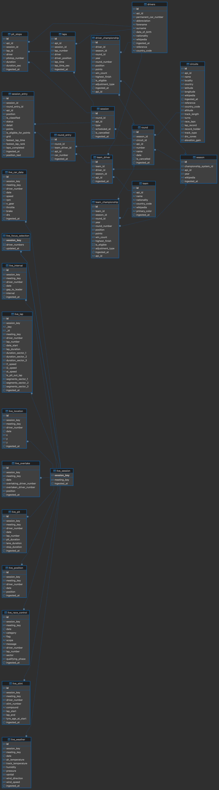

# Formula 1 Bloomberg Terminal

A Bloomberg-style analytics terminal for Formula 1. It ingests decades of historic
race data into PostgreSQL, streams live session telemetry through an AWS pipeline,
and surfaces everything through a dense, dark-first web dashboard plus a LangGraph
chat agent that answers questions from FIA regulations, the database, or the model's
own F1 knowledge.

There are three products in one:

- **Historical Dashboard** — championship progression, driver/team/circuit summaries,
qualifying head-to-heads, pit-stop and lap analytics over F1 data from **2011–2025**.
- **Live Terminal** — real-time leaderboard, telemetry, track map, and race-control
feed driven by the OpenF1 firehose (with a bundled mock replay between races).
- **Terminal Chat** — a routed multi-agent chatbot over F1 regulations (RAG) and the
race database (text-to-SQL → charts).

---

<<<<<<< HEAD
### Chatbot Langmsith Trace Example


### Chatbot Langsmith Monitoring Example


### Database Schema: 

=======


## AWS Architecture


The platform runs as a small, cost-conscious AWS footprint:

- **CloudFront + S3** serve the static frontend (no data in the bucket).
- **EC2 (t3.micro spot, Elastic IP)** hosts the FastAPI backend, exposing
`/api/v1/chat` and the historical/live REST API. An Auto Scaling group keeps it healthy.
- **AWS Fargate** runs `stream_worker.py` as an always-on task holding a persistent
websocket/MQTT connection to the **OpenF1** live firehose. A **Lambda orchestrator**
(triggered by **EventBridge**) does `RunTask`/`StopTask` around race sessions, pulling
the image from **ECR**.
- **SQS → Lambda consumers** fan the live stream into three topic queues — **timing**
(interval, lap, stints, pitstops, position), **telemetry** (location, car_data:
brake/speed/throttle/battery), and **session-events** (race-control, overtakes,
weather) — each landing in Postgres via a dedicated consumer Lambda.
- **Amazon RDS (PostgreSQL)** holds both the historical and live schemas, locked down
by a security group that only accepts inbound traffic from the whitelisted EC2/Lambda IPs.
- **MongoDB Atlas** stores the chunked + embedded FIA regulation documents for the RAG
subgraph (accessed from the EC2 backend).

CI/CD lives in `.github/workflows/` (`dev.yaml`, `prod.yaml`) with path-filtered
frontend/backend builds.

---

## Chatbot Architecture (LangGraph)


`app/chatbot/graph.py` compiles `terminal_chat`: a **router** classifies each user
turn and conditionally dispatches to one of four branches, all of which converge on
`record_turn` (multi-turn history persisted per `thread_id` via the checkpointer).


| Route               | Subgraph             | What it does                                                                                                                                    |
| ------------------- | -------------------- | ----------------------------------------------------------------------------------------------------------------------------------------------- |
| `REGULATION`        | `regulation/`        | Query rewrite → **Voyage** embed → **MongoDB** vector search over chunked FIA docs → rerank → synthesize → self-validate (with a rewrite loop). |
| `VISUALIZATION`     | `data_visual/`       | List tables → describe schema → generate **SQL** over Postgres → validate → execute → summarize rows and build an **ECharts** chart spec.       |
| `FORMULA_1_GENERAL` | `formula_1_general/` | Answers general F1 questions from the model's own training knowledge.                                                                           |
| `OUT_OF_SCOPE`      | —                    | Politely declines and redirects to regulations/data questions.                                                                                  |


The endpoint (`POST /api/v1/chatbot/chat`, in `app/router/chatbot.py`) **streams**
server-sent events: the model's routing "reasoning" text is surfaced token-by-token as
it's written, then the final answer. The LLM is **Claude** via `langchain-anthropic`.

Both the regulation and data-viz subgraphs run a **validate → rewrite** loop so a weak
first answer is refined rather than returned. Route classification has its own eval
harness and datasets in `app/chatbot/evals/`.

---


## Database Schema



Everything lives in a single Postgres `bronze` schema, managed by Alembic
(raw SQL via `op.execute()`, not an ORM). Two families of tables:

**Historical** — `season`, `round`, `session`, `circuits`, `drivers`, `team`,
`team_driver`, `round_entry`, `session_entry` (per-driver results), `driver_championship`,
`team_championship`, `laps`, and `pit_stops`.

**Live** (`live_`*, keyed by OpenF1 `session_key` / `meeting_key`) — `live_session`,
`live_lap`, `live_car_data` (throttle/brake/speed/drs), `live_location`, `live_interval`,
`live_position`, `live_stint` (tyre compound + age), `live_pit`, `live_overtake`,
`live_race_control`, `live_weather`, and `live_focus_selection`.

> **Known bronze data gaps** the frontend works around (see `CLAUDE.md`): `is_classified`
> is NULL everywhere; `fastest_lap_time` sometimes stores a total/gap and is validated to
> a 40s–900s window; `team.primary_color` is NULL (curated color map used instead); DNF
> cause detail is only meaningful pre-2023; only Race sessions have `session_entry` rows.

---


## Repository Layout

```
app/
  main.py            # FastAPI app ("F1 Terminal API"), mounts router at /api/v1
  router/            # REST resources: seasons, rounds, sessions, results, drivers,
    analytics/       #   teams, circuits, championships, markets, meta, chatbot
    ...              # analytics/: championships, comparisons, pitstops, qualifying, summaries
  chatbot/           # LangGraph terminal_chat (router + 4 subgraphs), state.py, evals/
  pipeline/
    ingest/          # Historic data ingest + FIA regulation chunk/embed → MongoDB
    live/            # OpenF1 stream_worker, Fargate orchestrator, SQS consumers,
                     #   mock message producer, Polymarket odds client
core/
  database.py        # Postgres connection helper + MongoDB URI accessor
  alembic/versions/  # Migrations (raw SQL)
frontend/            # Vite + React + TS dashboard (Tailwind v4, TanStack Query, ECharts)
  src/features/      # dashboard widgets, live terminal, team profiles
.github/workflows/   # dev + prod CI/CD
```

The frontend is a Bloomberg-terminal-styled SPA — strict-black rail, hairline strokes,
JetBrains Mono data type, dual (dark/light) theme, ECharts + dither-kit widgets. It also
integrates **Polymarket** prediction-market odds for F1 events.

---


## Getting Started


### Backend

```bash
python -m venv .venv && source .venv/bin/activate
pip install -r requirements.txt

# .env at repo root (see .env.example)
#   DATABASE_URL=postgresql+psycopg://USER@HOST:PORT/DBNAME
#   ANTHROPIC_API_KEY=...        # chatbot LLM
#   VOYAGE_API_KEY=...           # regulation-doc embeddings
#   MONGODB_URI=...              # regulation chunk/embedding store (+ GridFS)
#   MONGODB_DATABASE_NAME=...

.venv/bin/alembic upgrade head                       # apply migrations
uvicorn app.main:app --reload --port 8000            # API docs at :8000/docs
python -m app.pipeline.ingest.main                   # run the historic ingest
```


### Frontend

```bash
cd frontend && npm install && npm run dev            # http://localhost:3000 (proxies /api → :8000)
cd frontend && npm run typecheck && npm run build    # checks
```


## Tech Stack

**Backend** FastAPI · PostgreSQL (RDS) · Alembic · psycopg3 · MongoDB Atlas ·
LangGraph · LangChain · Anthropic Claude · Voyage embeddings · boto3/aiobotocore · aiomqtt
  ·   **Frontend** Vite · React · TypeScript · Tailwind v4 · TanStack Query · ECharts
  ·   **Cloud** EC2 · Fargate · Lambda · SQS · EventBridge · ECR · S3 · CloudFront · RDS
  ·   **Data** OpenF1 (live + historic) · FIA regulation PDFs · Polymarket
>>>>>>> af89d6c (Enhance README.md with detailed product descriptions, AWS architecture, and chatbot workflow. Streamline the live data producer code by removing outdated comments and improving clarity.)
